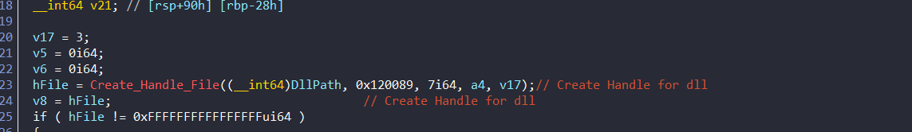
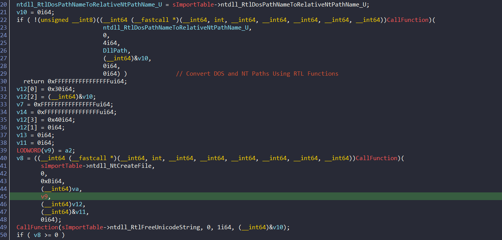
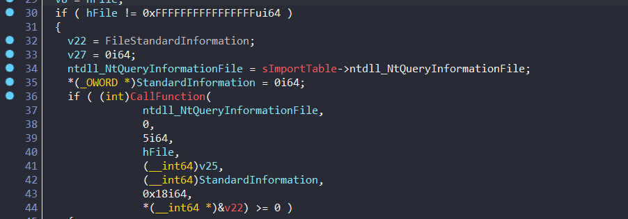
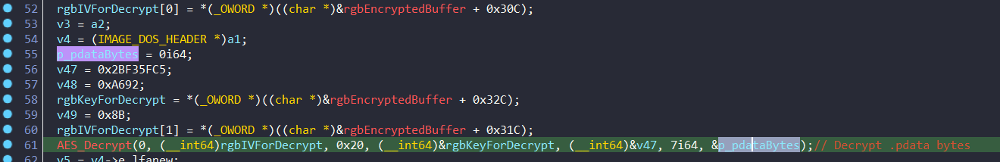
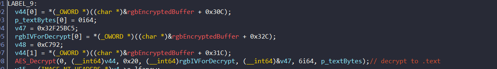
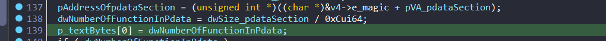

Link: https://www.zscaler.com/blogs/security-research/dodgebox-deep-dive-updated-arsenal-apt41-part-1#technical-analysis

## Code flow

The code flow is as follows:
- Decrypt the config of DodgeBox
- Check the conidtion and setup environment
- Decrypt Moonwalk payload dat file and use env keying to re-encrypt payload
- Spoofing call stack

### First stage
First, the dll is sideloaded by a legitmate program. All exports function withins the dll point to a single func that always invokes main function of malware. Beside, this single function have a `dwExportedFunction` variable that is used to determine which function to call only 1 time.

```cpp
void SbieDll_Hook()
{
  if ( dwExported_Function )
  {
    Sleep(0xFFFFFFFF);
  }
  else
  {
    qword_18002CFB8 = hSbieDll;
    dwExported_Function = 1;
    MalwareMain();
  }
}
```

### Decrypt the config
```cpp
if ( (unsigned __int64)(unsigned int)cbEncryptedBuffer + 0x44 > 0x310 )
    goto CALL_TERMINATE_PROCESS;
  v40 = 0i64;
  MD5(rgbAESKey_ForMain, 0x34ui64, &v40);
  if ( rgbMD5HashOfAESSecrets != v40 )
    goto CALL_TERMINATE_PROCESS;
  v40 = 0i64;
  MD5(rgbEncryptedBuffer.szArgFlag, (unsigned int)cbEncryptedBuffer, &v40);
  if ( rgbMD5OfEncryptedConfig != v40 )
    goto CALL_TERMINATE_PROCESS;
```


Trong MalwareMain, chương trình sẽ kiểm tra xem config có bị thay đổi không bằng cách so sánh MD5 của config với MD5 của config đã được giải mã. Nếu không giống nhau, chương trình sẽ kết thúc.

```cpp
if ( !(unsigned int)AES_Decrypt(
                        0,
                        (__int64)rgbAESKey_ForMain,
                        0x10,
                        (__int64)&rgbAESIV,
                        (__int64)&rgbEncryptedBuffer,
                        (unsigned int)cbEncryptedBuffer,
                        &rgbEncryptedBuffer) )
    goto CALL_TERMINATE_PROCESS;
  pEncryptedBuffer = (__int64)&rgbEncryptedBuffer;
```
Sau khi check xong config, chương trình sẽ giải mã config bằng AES với key và IV.


### Dll unhook
Function: Offset: 0x6fa0
Tạo handle cho file dll bằng cách sử dụng hàm Create_Handle_File.


Hàm `Create_Handle_File` sử dụng 3 hàm đã resolve từ trước đó là : `ntdll_RtlDosPathNameToRelativeNtPathName_U`, `ntdll_NtCreateFile` và `ntdll_RtlFreeUnicodeString` để tạo handle cho file dll với path đã được cung cấp.


Tiếp tục, nếu handle khác INVALID_HANDLE, hàm sub_6F70 dùng ntdll_NtQueryInformationFile để lấy thông tin file và lưu vào biến StandardInformation.



Offset: 0x71d0
Ban đầu, hàm sẽ decrypt AES chuỗi byte ".pdata" và trích struct `IMAGE_SECTION_HEADER` của section này. 




Sau đó, hàm sẽ decrypt chuỗi byte ".text" và trích struct `IMAGE_SECTION_HEADER` của section này. 



Trích xuất địa chỉ của section ".pdata" và số lượng hàm có trong section này. 



